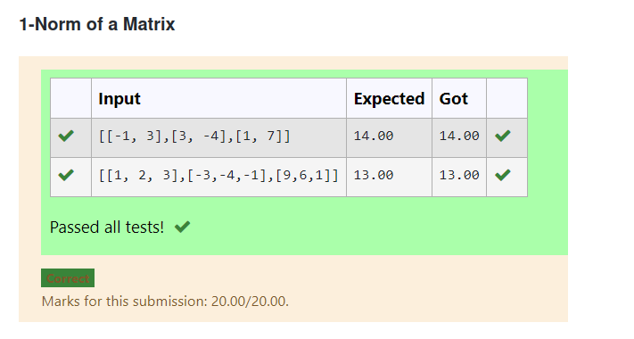
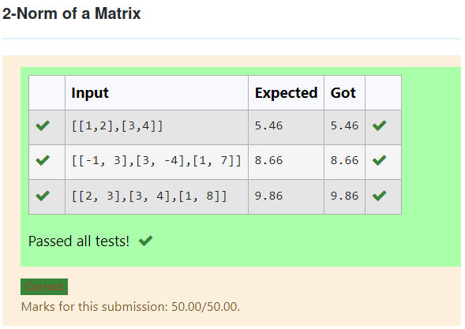
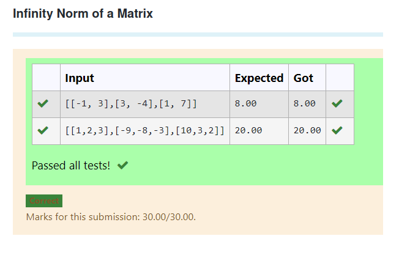

# Norm of a matrix
## Aim
To write a program to find the 1-norm, 2-norm and infinity norm of the matrix and display the result in two decimal places.
## Equipment’s required:
1.	Hardware – PCs
2.	Anaconda – Python 3.7 Installation / Moodle-Code Runner
## Algorithm:
	1. Get the input matrix using np.array()   
    2. Find the 2-norm of the matrix using np.linalg.norm()
	3. Print the norm of the matrix in two decimal places.
## Program:
```Python
# Register No: SUDHAKAR K
# Developed By: 22007876
# 1-Norm of a Matrix

import numpy as np 
a=np.array(eval(input()))
n = np.linalg.norm(a,1)
print("{:.2f}".format(n))


# 2-Norm of a Matrix

import numpy as np 
a=np.array(eval(input()))
n = np.linalg.norm(a,2)
print("{:.2f}".format(n))


# Infinity Norm of a Matrix

mport numpy as np
mat = np.array(eval(input()))
ans = np.linalg.norm(mat,np.inf)
Norm_of_matrix = "{:.2f}".format(ans)
print(Norm_of_matrix)


```
## Output:



##



## 



## Result
Thus the program for 1-norm, 2-norm and Infinity norm of a matrix are written and verified.
